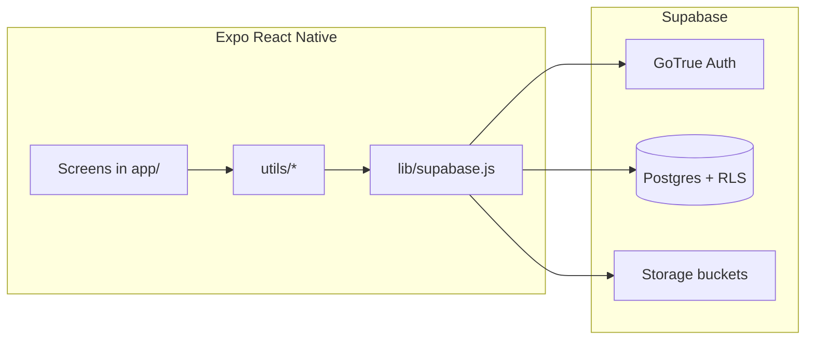
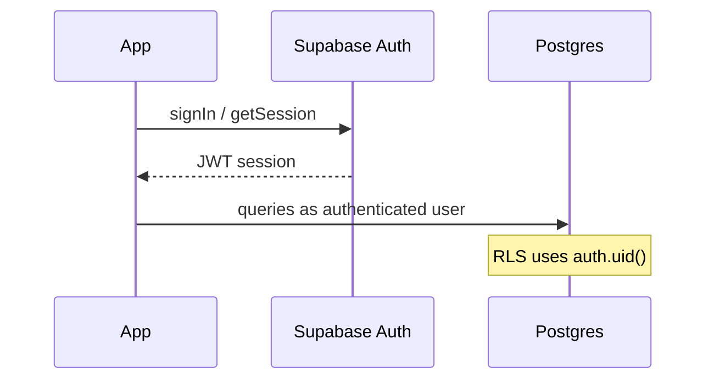
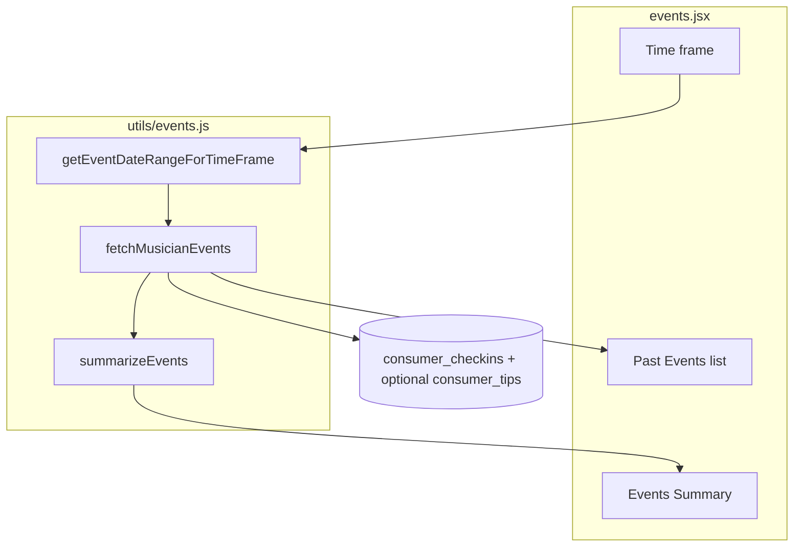
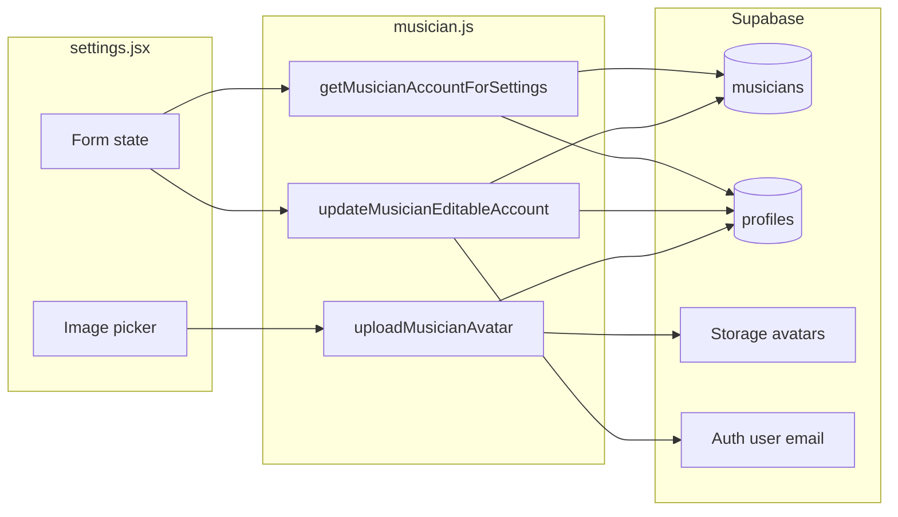

# sc-app — Architecture

Single source of truth for how the app is structured, which Supabase objects it touches, and how major musician features flow through the codebase. Update this file when you add routes, tables, or cross-cutting behavior.

---

## 1. Purpose

**sc-app** is a React Native app built with **Expo** and **Expo Router**, backed by **Supabase** (Postgres, Auth, Storage). It supports **musicians** and **music consumers** with separate onboarding and home experiences.

---

## 2. Tech stack

| Layer | Choice |
|--------|--------|
| UI | React Native 0.81, React 19 |
| App shell / routing | Expo Router (file-based routes under `app/`) |
| Backend | Supabase (`@supabase/supabase-js`) |
| Session persistence | AsyncStorage (configured in `lib/supabase.js`) |
| Charts (insights) | `react-native-chart-kit`, `react-native-svg` |
| Profile photos (settings) | `expo-image-picker`, `expo-image`, Storage bucket `avatars` |

---

## 3. Repository layout (high level)

```text
app/                 # Screens & layouts (Expo Router)
components/          # Shared UI (dropdowns, insights, Logo)
lib/supabase.js      # Supabase client singleton
utils/               # Auth, profile checks, musician/consumer/events helpers
docs/ARCHITECTURE.md # This document
```

---

## 4. Runtime architecture



---

## 5. Authentication

- **Sign-in / sign-up / sign-out** live in `utils/auth.js` and are used from login/signup flows.
- **Session** is stored via AsyncStorage; the client uses the anon key with **RLS** enforcing row access in Postgres.
- **Post-login routing** uses `utils/profile.js` (`checkUserProfile`) to see whether the user is a musician or consumer and whether onboarding is complete.



---

## 6. Navigation — musician

- **Tabs:** `app/musicianHomepage/_layout.jsx` — Homepage, Insights, Events, Settings.
- **Public profile preview:** `app/musicianProfile/[id].jsx` — loaded via `utils/musician.js` (`getMusicianProfileById`).
- **Root stack:** `app/_layout.jsx` (stack, headers hidden by screen options).

---

## 7. Feature: Musician → Events

**Goal:** Show a time-filtered list of performances derived from **consumer check-ins** for the signed-in musician, plus aggregate stats.

| Concern | Location |
|---------|----------|
| UI | `app/musicianHomepage/events.jsx` |
| Time ranges & fetch | `utils/events.js` |
| Filter dropdown | `components/EventTimeFrameDropdown.jsx` |

**Data:** `public.consumer_checkins` — filter by `musician_id = auth.uid()` and `event_date` in range. Optional embed `consumer_tips ( amount )`; if the embed fails (relationship naming), the client retries without it and uses `tip_amount` on the check-in row only.

**Important — Supabase JS query order:** `.from()` → **`.select()`** → `.eq()` / `.gte()` / `.lte()` / `.order()`. Filters must not precede `.select()`.



---

## 8. Feature: Musician → Account / Settings

**Goal:** View account data, edit allowed fields, upload avatar, preview public profile, log out.

| Concern | Location |
|---------|----------|
| UI | `app/musicianHomepage/settings.jsx` |
| Load / save / avatar | `utils/musician.js` — `getMusicianAccountForSettings`, `updateMusicianEditableAccount`, `uploadMusicianAvatar` |
| Logout | `utils/auth.js` — `signOut` |

**Read-only in UI (not sent as updates from this screen’s save path):** first name, last name, genre, birthday, age — sourced from `musicians` for display only.

**Editable:** email, username, artist name, location, bio — persisted on `musicians` and `profiles.email` where applicable. If **email** changes, **`auth.updateUser({ email })`** runs before DB updates so Supabase Auth stays consistent.

**Avatar:** `expo-image-picker` → `uploadMusicianAvatar` uploads to Storage **`avatars`** at `{user_id}/avatar.{ext}` → `profiles.avatar_url` updated with the public URL.



---

## 9. Supabase surface area (reference)

| Area | Tables / resources | App usage |
|------|-------------------|-----------|
| Auth | `auth.users` | Login, session, optional email change from settings |
| Profiles | `profiles` | Email, `avatar_url`; linked 1:1 with user id |
| Musicians | `musicians` | Musician profile fields, events `musician_id`, check-ins `musician_id` |
| Consumers | `consumers` | Consumer flows |
| Insights / social | `consumer_reviews`, `consumer_follows`, etc. | Insights tabs |
| Events | `consumer_checkins`, `consumer_tips` | Musician Events screen |
| Storage | Bucket `avatars` | Profile photo uploads |

**RLS:** Every table the app reads or writes must have policies that match how the client queries (e.g. musicians can `SELECT` their own `consumer_checkins` by `musician_id`).

---

## 10. Configuration & environment

- **Env vars:** `EXPO_PUBLIC_SUPABASE_URL`, `EXPO_PUBLIC_SUPABASE_ANON_KEY` (see `lib/supabase.js`).
- **Deep link scheme:** `scapp` (`app.json`).
- **iOS photo/camera:** `expo-image-picker` plugin entries in `app.json`.

---

## 11. Operational notes (local dev)

- **Metro already on 8081:** Stop the other process or use one terminal for `npm start`.
- **Git `index.lock`:** If a Git command crashed, remove `.git/index.lock` after confirming no other Git process is using the repo.
- **`ETIMEDOUT` reading `node_modules`:** Often a corrupted or cloud-synced file tree; a clean `rm -rf node_modules && npm install` usually fixes it.

---

## 12. Related docs

- Project setup and Supabase pointers: [README.md](../README.md)

When you add a major feature, add a short subsection here (or a linked `docs/feature-*.md`) so this doc stays the canonical map.
